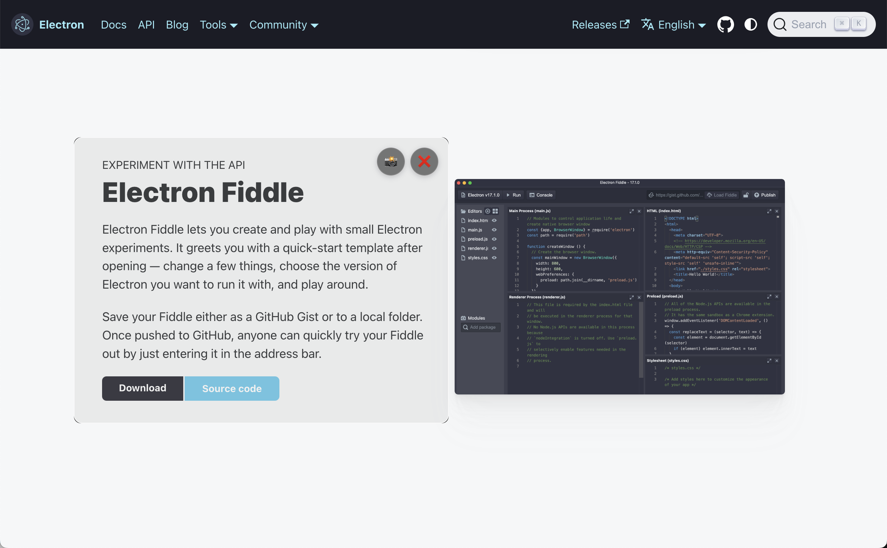
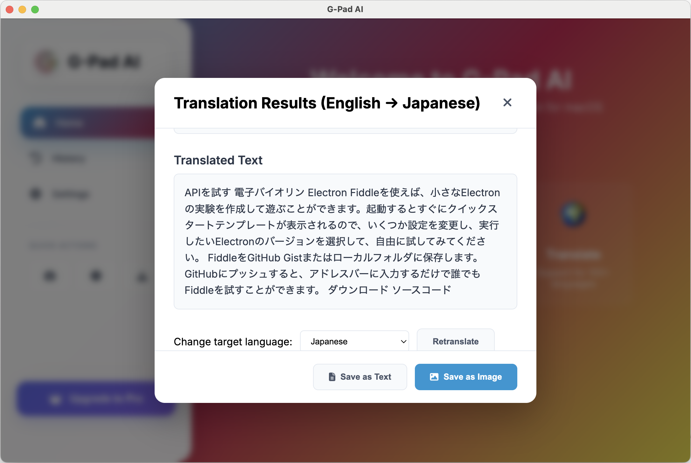
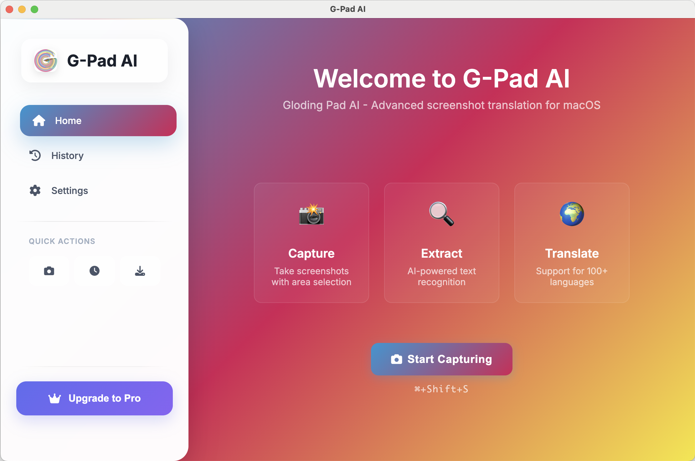

# G-Pad AI: Advanced Screenshot Translation

G-Pad AI is a powerful desktop application for seamless and intelligent screenshot translation on macOS. Built with Electron, it leverages Google's Cloud Vision and Translation APIs to provide a best-in-class experience for developers, designers, and anyone working with multilingual content.

This tool moves beyond simple text translation, allowing you to capture any part of your screen, automatically recognize the text within the image, and overlay the translation directly onto a new image, preserving the original context.

## App Showcase

**The new interactive Lup for capturing content:**


**Viewing the translation result inside the Lup:**


**Main application window with translation history:**


## Key Features

*   **Interactive "Lup" Capture**: A movable, resizable magnifying glass window for precise screen captures. No more clumsy click-and-drag!
*   **Just-in-Time Screenshots**: The screen is captured the instant you click, guaranteeing what you see is what you get.
*   **AI-Powered Text Recognition**: Utilizes Google Cloud Vision API for highly accurate text extraction from any image.
*   **Seamless Translation**: Integrates with Google Cloud Translation API for fast and reliable translations in over 100 languages.
*   **Automatic Language Detection**: Intelligently detects the source language (e.g., Japanese) and automatically translates to your preferred language (e.g., English).
*   **Contextual Image Overlay**: Generates a new image with the translated text perfectly drawn over the original text locations.
*   **Translation History**: Keeps a record of your previous translations for easy access and reference.
*   **Modern, Cross-Platform UI**: Built with Electron for a consistent and native experience on macOS.
*   **Global Shortcut**: Activate the capture lup from anywhere with a simple keyboard shortcut (`CmdOrCtrl+Shift+S`).

## Google Cloud API Setup

To enable text extraction and translation features, you need to set up Google Cloud APIs:

### Step 1: Create a Google Cloud Project

1. Go to [Google Cloud Console](https://console.cloud.google.com/)
2. Click "Create Project" or select an existing project
3. Give your project a name (e.g., "TranslatorPad AI") and click "Create"

### Step 2: Enable Required APIs

1. In the Google Cloud Console, go to "APIs & Services" > "Library"
2. Search for and enable these APIs:
   - **Cloud Vision API** (for text extraction from images)
   - **Cloud Translation API** (for translating text)

### Step 3: Create Service Account Credentials

1. Go to "APIs & Services" > "Credentials"
2. Click "Create Credentials" > "Service Account"
3. Fill in the service account details (e.g., name: `translatorpad-service`)
4. Click "Create and Continue". Grant these roles:
   - `Cloud Vision API Service Agent`
   - `Cloud Translation API Service Agent`
5. Click "Continue" then "Done"

### Step 4: Download the JSON Key File

1. In the "Credentials" page, click on your new service account's email.
2. Go to the "Keys" tab, click "Add Key" > "Create New Key".
3. Choose "JSON" format and click "Create". A JSON file will be downloaded.

### Step 5: Setup the Credentials in the App

1. Create a `credentials` folder in your project root.
2. Copy the downloaded JSON file into the `credentials` folder and **rename it to `google-cloud-key.json`**.
3. The app will automatically detect and use this file upon restart.

## Installation

1. **Clone the repository**
   ```bash
   git clone <repository-url>
   cd translatorpad-ai-electron
   ```

2. **Install dependencies** (pnpm is recommended)
   ```bash
   pnpm install
   # or
   npm install
   ```

3. **Set up Google Cloud credentials** (see instructions above).

## Usage

*   **Run in Development Mode**: `pnpm dev` (or `npm run dev`)
*   **Build for Production**: `pnpm build:mac` (or `npm run build:mac`)
*   **Run Production App**: `pnpm start` (or `npm start`)

## Project Structure

```
translatorpad-ai-electron/
├── src/
│   ├── main/
│   │   ├── main.js              # Main Electron process, includes Lup logic
│   │   ├── preload.js           # Preload script for security
│   │   └── services/
│   │       ├── visionService.js
│   │       ├── translationService.js
│   │       └── screenshotService.js
│   └── renderer/
│       ├── index.html           # Main application window
│       ├── styles/
│       │   └── main.css         # Main application styles
│       └── scripts/
│           └── main.js          # Renderer process logic
├── assets/
│   ├── icons/
│   │   └── gloding-logo.png     # Application icon
│   └── screenshots/
│       └── main-app.png         # Showcase screenshot
├── credentials/                 # Stores Google Cloud key (gitignored)
├── package.json                 # Project configuration
└── README.md                    # This file
```
